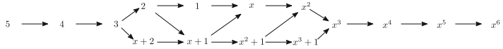

# Discrete Homotopy Polynomial & Distance

This project provides a Python implementation of algorithms 1 and 2 described in **Section 3** of the paper [*Brain Chains as Topological Signatures for Alzheimer's Disease*](https://link.springer.com/article/10.1007/s41468-024-00168-7) by Goodbrake et al. We also provide a boolean function that indicates when two maximal chains of the same length are *interleaved*.

- **`discrete_homotopy_distance.py`**: This file contains all of the implementations described above.
- **`README.me`**: Narration and documentation.
- **`example.ipynb`**: Contains an example using $\mathcal{H}(5)$.
- **`requirements.txt`**: Lists the dependencies required.

## An Example

1. **Construct the poset $\mathcal{H}(5)$**: Indicate the the number of nodes (here $N=5$) and the successor function to be used. A visualizatoin of the homotopy poset $\mathcal{H}(5)$ is provided below along with a representative for each equivalence class.

   ```python
   import discrete_homotopy_distance as dhd
   import random
   
   _, E = dhd.homotopy_polynomial_poset(5, dhd.succs)
   print(E)
   ```


2. **Construct chains in $\mathcal{H}(5)$**: Define a helper function to construct two random chains in $\mathcal{H}(5)$.

   ```python
   def random_edge_chain(N, seed=None):
     if seed is not None:
     random.seed(seed)

     G = nx.Graph()
     G.add_nodes_from(range(N))
     graph_list = [G.copy()]

     all_edges = [(i,j) for i in range(N) for j in range(i+1, N)]
     random.shuffle(all_edges)

     for edge in all_edges:
     G.add_edge(*edge)
     graph_list.append(G.copy())

     return graph_list

   graphs1 = random_edge_chain(5)
   graphs2 = random_edge_chain(5)

   chain1 = dhd.create_chain(graphs1, dictionary=True)
   chain2 = dhd.create_chain(graphs2, dictionary=True)
   ```
3. **Check interleaving**: Determine if the chains are interleaved.

   ```python
   print(dhd.isInterleaved(chain1, chain2, 5)
   ```
